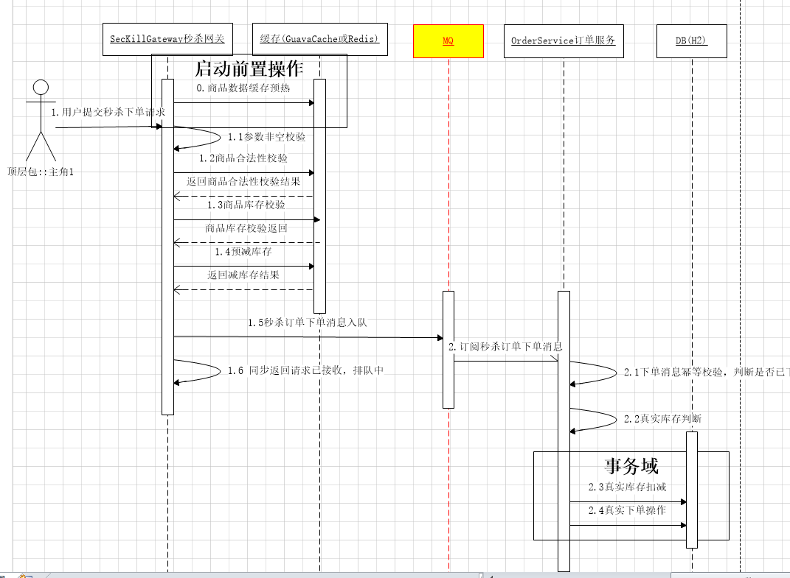
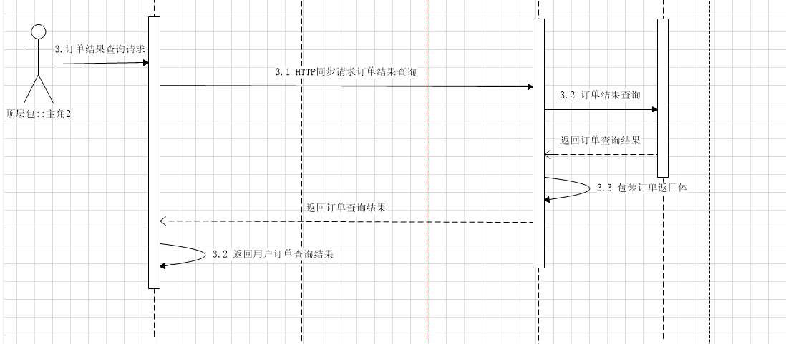

# seckill-rocketmq[基于RocketMQ-电商高并发场景实战]

> 场景为：示例项目以用户访问秒杀网关进行秒杀订单下单，平台通过RocketMQ对秒杀流量进行削峰填谷。用户通过主动查询订单
获取下单结果的完整业务流程，加深对RocketMQ的理解，并学会如何在实战场景下使用RocketMQ。

> 项目基本按照实际秒杀场景进行设计与编码，提供了充分的预校验逻辑，可以作为业务中开发的参考demo。

## 主要技术

    消息队列（RocketMQ）: 作用，长流程异步化，提升吞吐量，削峰填谷
        |-普通消息的发布及订阅
    SpringBoot
        |-配置资源预加载
    RestTemplate
        |-application/x-www-form-urlencoded格式数据的发送
    H2
        |-嵌入式数据库

## 业务流程图

业务流程图如下

### 秒杀下单流程

### 订单查询流程

## 模块描述

| 模块 | 说明 |
|  :------ |  :------ |
|  seckill-rocketmq  |  父工程  |
|  seckill-gateway-service  |  秒杀收单网关，提供秒杀下单入口，提供用户主动查单接口   |
|  seckill-order-service  |  秒杀订单平台，通过整合RocketMQ，消费秒杀下单消息；提供内部订单查询实现   |
|  seckill-message-protocol  |  消息协议封装  |

## 业务描述
1. 用户访问秒杀网关seckill-gateway-service，对感兴趣的产品发起秒杀操作。
2. 网关对秒杀订单进行充分的预校验之后，将秒杀下单消息投递到RocketMQ中，同步给用户返回排队中
3. 秒杀订单平台seckill-order-service订阅秒杀下单消息，对消息进行幂等处理，并对商品库存进行真实校验后，进行真实下单操作
4. 用户通过秒杀网关seckill-gateway-service提供的查单进行对自己下的秒杀订单进行查询。

真实场景下，在下单前有绑定账号、绑定收货地址等操作；下单完成后还有支付、物流等操作。

本demo的重点在于如何在秒杀核心场景使用RocketMQ进行业务异步化及订单的压单操作，因此对于细节不予实现，敬请谅解。

> 注意：商品信息直接在初始化的时候记载到seckill-gateway-service，进行前置库存校验。此处依据缓存已经做了一次流量的过滤。

> 订单真实下单的时候，进行库存真实校验，此时请求量已经不大了，从而做到对核心资源（DB）的保护。

## 待优化

> 由于本项目主要目的在于使用RocketMQ进行削峰填谷，因此对于部分秒杀场景的业务处理尚未优化，此处列出待优化的点，供读者参考

1. 分布式减库存：使用Redis的decr进行分布式原子减库存
2. 预热库存时候将库存适当调大，防止恶意刷库存导致正常用户不能进行正常的秒杀订单投递
3. 【注意点】数据库侧的库存校验万万不能少，本demo已经加上了该校验
4. 秒杀接口需要做防刷处理，可以在前端通过倒计时方式定时开放接口、增加验证码减少下单频率、增加下单前校验收货地址等方式

## windows下单点RocketMQ搭建
0. 解压rocketmq-all-4.4.0-bin-release.zip到C盘根目录，或者某个盘的根目录（我是C盘）

        配置环境变量，增加环境变量
        ROCKETMQ_HOME=C:\rocketmq-all-4.4.0-bin-release（不要出现空格和中文）

1. 启动nameServer

        mqnamesrv.cmd
2. 启动broker

        start mqbroker.cmd -n 127.0.0.1:9876 autoCreateTopicEnable=true
3. 启动admin-console

        java -jar -Drocketmq.config.namesrvAddr=127.0.0.1:9876 rocketmq-console-ng.jar

[windows下RocketMQ安装部署](https://www.jianshu.com/p/4a275e779afa)

## H2后台地址
1. 秒杀网关：http://localhost:8070/h2/
2. 秒杀下单：http://localhost:8071/h2/

## 混合云支持
> 支持了ACL方式，编译打包后运行,云上envType为aliyun，线下envType为offline

    网关
    java -jar -DenvType=aliyun seckill-gateway-service-1.0.0.jar
    下单
    java -jar -DenvType=aliyun seckill-order-service-1.0.0.jar
    
> 下单之后进行订单查询，使用curl命令

    curl http://127.0.0.1:8071/api/query.do -X POST -d  "userPhoneNum=15288888881&prodId=pid_0001"